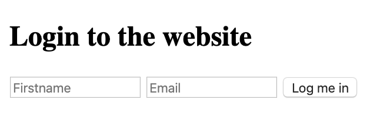
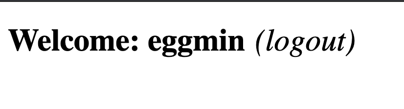
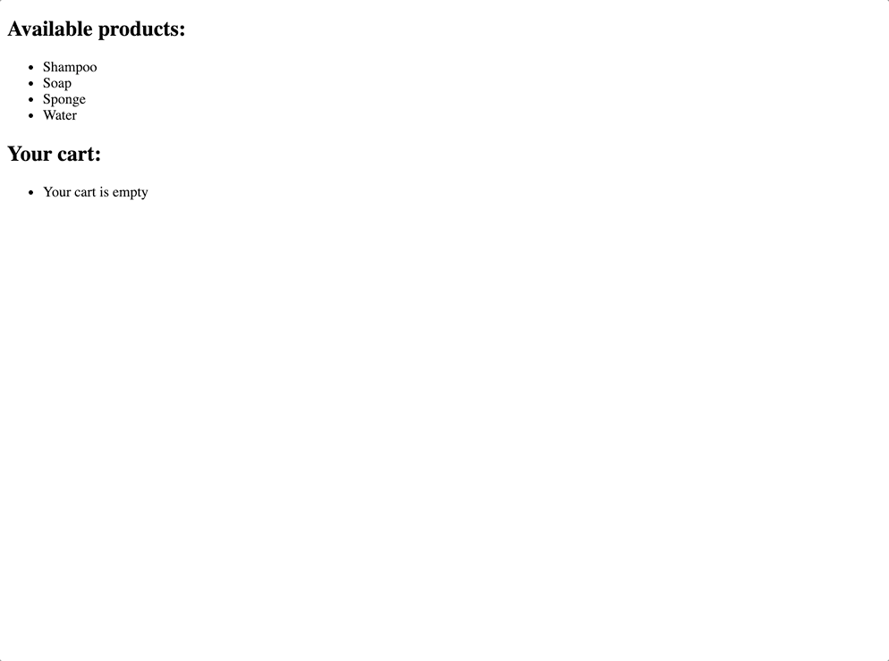

## Cookies & local storage

#### Resources

<a href="https://www.w3schools.com/js/js_cookies.asp">Cookies and Javascript</a>
<a href="https://intranet.alxswe.com/rltoken/kzI71T3JgeL87DYlFzS5Gg">HTTP Cookies</a>
<a href="https://intranet.alxswe.com/rltoken/YW3GbxgexH4ckfEpMX-kvg">js-cookie</a>
<a href="https://www.w3schools.com/html/html5_webstorage.asp">Web storage</a>

## Tasks

### 0. Create basic cookie

mandatory

- <b>Install your development environment:</b>

      - Installwebpack-dev-server by running npm install webpack-dev-server --save-dev (if you have some errors of missing dependencies, install these packages: npm i -D webpack and npm i -D webpack-cli)
      - Create an empty file src/index.js
      - Run your server with node_modules/.bin/webpack-dev-server

  <b>In a file 0-index.html, create a basic html template:</b>

- Add two text inputs, with the id firstname and email
- Add one button with the text “Log me in” that will call the function setCookies
- Add one button with the text “Show the cookies” that will call the function showCookies
- Create a function setCookies:

  - It should set the cookie firstname with the value in the firstname input
  - It should set the cookie email with the value in the email input

- Create a function showCookies:

  - It should create a DOM element p
  - It should set the inner html with Cookies: and the value of the cookie
  - It should append the paragraph at the bottom of the page

- <b>Requirements:</b>

  - Try to make your page to look as close to the image below as possible
  - Access your code with http://localhost:8080/0-index.html
  - Use vanilla javascript to complete the task

Tips:

If you are using VSCode, you can use the plugin <a href ="https://intranet.alxswe.com/rltoken/KOwyfGyDZ-jCUv4c09dHjQ">live server</a>

## 1. Create cookie with expiration date and specific path

mandatory
<b>In a file 1-index.html:</b>

- Reuse the code of the previous task
- Modify the way you are setting cookies to expire in 10 days

<b>Requirements:</b>

- Access your code with http://localhost:8080/1-index.html
- Use vanilla javascript to complete the task

## 2. Read cookie

mandatory
In a file 2-index.html:

- Reuse the code of the previous task
- Create a function getCookie:

  - It accepts name as argument
  - It should return the value of the cookie with the name passed in argument
  - If the cookie does not exist, it should return an empty string

- Modify the function showCookies:

      - It should display the paragraph Email: EMAIL - Firstname: FIRSTNAME

  Requirements:

- Access your code with http://localhost:8080/2-index.html
- Use vanilla javascript to complete the task

## 3. Delete cookie and mini application

- mandatory
- in a file 3-index.html, reuse your code from the previous task

- add a div in html that will contain the login form:

  - You can reuse the one you previously wrote
  - It has one h2
  - It has two text inputs
  - It has one button

- Write a function named showForm:

  - It should remove the Welcome message if it exists
  - It should show the form

- Write a function named hideForm:

  - It should hide the form

- Write a function named deleteCookiesAndShowForm:

  - It should remove the two cookies
  - it should show the form by calling the showForm function

- Write a function named showWelcomeMessageOrForm:

      - if user is not logged in, the function showForm is called
      - If the user is logged in, replace the body of the page with a h1
          - It should display Welcome FIRSTNAME (logout)
          - (logout) should be a link
              - The link font should be display in normal weight, italic, and 10px to the right of the message
              - On click, call the function deleteCookiesAndShowForm, hide the welcome message, and show the form

  Requirements:

  - Access your code with http://localhost:8080/3-index.html
  - Use vanilla javascript to complete the task
  - Build the Welcome message with Javascript without using HTML

The login form should look like the image below

When a user is logged in the page should look like the image below

## 4. Use js-cookie

<b>Reusing the code from the previous task:</b>

- Add js-cookie to your html page using the jsdelivr CDN
- Delete the getCookie function and use js-cookie get function instead
- Use js-cookie remove function within deleteCookiesAndShowForm function
- Use js-cookie set function within setCookiesAndShowWelcomeMessage function (new function that sets cookies and calls showWelcomeMessageOrForm)
  <b>Requirements:</b>
  - Access your code with http://localhost:8080/4-index.html
  - Build the Welcome message with Javascript without using HTML
  - Use js-cookie for every cookie manipulation

## 5. Local storage

<b>Let’s build a basic shopping cart in a new file. Setup your files with the following:</b>

- Create an array availableItems that will contain all the available items. Add the strings Shampoo, Soap, Sponge, and Water in the array
- If Local storage is not enabled on your browser, display an alert that will contain the message Sorry, your browser does not support Web storage. Try again with a better one
- If local storage is available it should allow the user to see the application and call the function createStore and displayCart

<b>Create a function addItemToCart:</b>

- It takes on argument item (string)
- It adds a key to the local storage of the name of the item, and set the value to true

<b>Create a function createStore:</b>

- Create a ul and append it to the DOM
- Loop through the array of items, and create a list item to add to the ul
- The item should display the name of the available product
- On click the item should call the function addItemToCart

<b>Create a function displayCart:</b>

- If the local storage does not contain any item, this function does not do anything
- If the local storage contains any item, it should display the message You previously had X items in your cart in a p element that you can append to the body
  <b>Tips:</b>

- At this time, you should be able to see the list of available items
- If you click on two of them and refresh the browser, you should see the message You previously had 2 items in your cart
- If you open a new tab, you should also see the message You previously had 2 items in your cart
  <b>Requirements:</b>

- Build the DOM using Javascript only
- You must use the local storage of your browser and not a cookie or session storage
- Access your code with http://localhost:8080/5-index.html
- Build every feature with vanilla Javascript only

## 6. Session storage

Reusing the code from the previous task, replace the use of local storage by session storage

<b>Tips:</b>

- At this time, you should be able to see the list of available items
- If you click on two of them and refresh the browser, you should see the message You previously had 2 items in your cart
- If you open a new tab, you should not see any message
  <b>Requirements:</b>

- Build the DOM using Javascript only
- You must use the session storage of your browser and not a cookie or local storage
- Access your code with http://localhost:8080/6-index.html
- Build every feature with vanilla Javascript only

## 7. Advanced use of web storage

<b>In a new file, let’s build a more advanced cart system using Session Storage. Setup your files with the following:</b>

- Create an array availableItems that will contain all the available items. Add the strings Shampoo, Soap, Sponge, and Water to the array
- If session storage is not enabled on your browser, display an alert that will contain the message Sorry, your browser does not support Web storage. Try again with a better one
- If session storage is available it should allow the user to see the application and call the function createStore and displayCart
  <b>Create a function getCartFromStorage:</b>

- It should parse a string into a JSON object, returning the content of the cart stored in Session storage
- If there is no cart, it should return an empty object

<b>Create a function addItemToCart:</b>

- It accepts item(string) as argument
- It adds to the cart object the item
- If the same item is added multiple times, the cart store the quantity
- It stores the value of the cart object in a string for the key cart in the Session Storage
- It calls displayCart

<b>Create a function removeItemfromCart:</b>

-
- It accepts item(string) as argument
- It remove the entire item from the cart
- Store the value of the cart object in a string for the key cart in the Session Storage
- It calls displayCart

<b>Create a function clearCart:</b>

- It should clear the entire Session storage
- it calls displayCart

<b>Create a function createStore:</b>

- It should add a h2 tag with the text Available products:
- It should add a list with every item available for purchase
- When the user click on an item, it should add it to the cart
  <b>Create a function displayCart:</b>

- It should add inside a h2 tag with the text Your cart:
- It should add an empty div tag
- If the div tag already exist, it should remove any list child
- It calls updateCart

<b>Create a function updateCart:</b>

- It should add a list to the div tag created previously
- If the cart is empty, it should add an item Your cart is empty
- If the cart is not empty, it should add the list of items within the cart with the following format: ITEM_NAME x QUANTITY (remove)
- When the user clicks on remove, it should call the function removeItemfromCart
- At the top of the cart, add an item named Clear my cart. When the user clicks on it, it should call the function clearCart
  <b>Tips:</b>

- You can look at the GIF below to see how the interaction with the different elements works
  

<b>Requirements:</b>

- Build the DOM using Javascript only
- You must use the session storage of your browser and not a cookie or local storage
- Access your code with http://localhost:8080/7-index.html
- Build every feature with vanilla Javascript only
- src/index.js should stay empty - all your Javascript must be in your HTML, inside <script> tag
